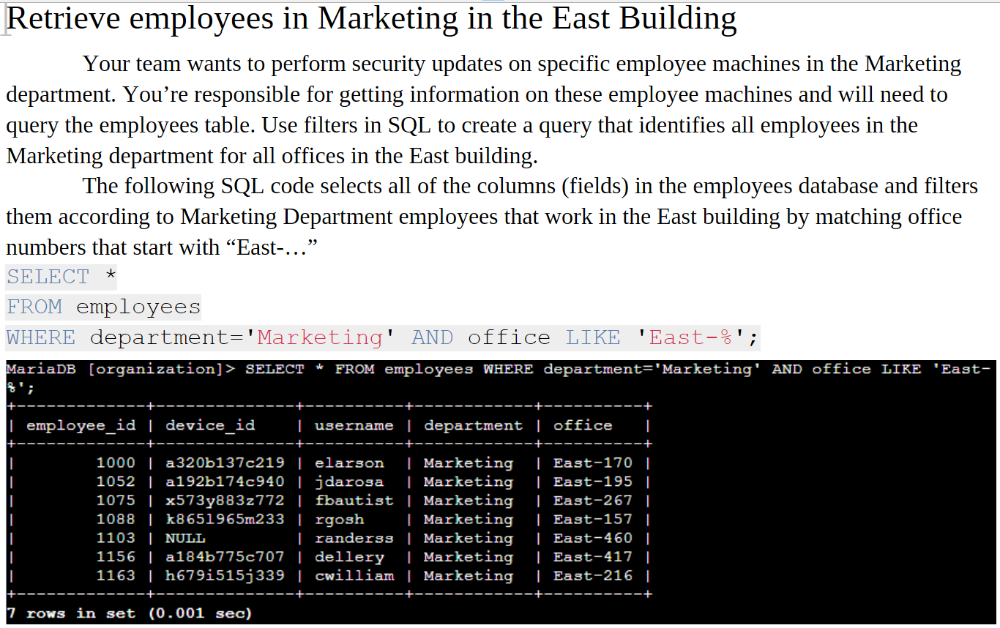

# SQL-Query-Filters
My SQL Portfolio Activity for the Coursera/Google Cybersecurity Certificate that I'm pursuing.

## Table of Contents
* [General Info](#General-info)
* [Author](#Author)
* [Techologies](#Technologies)
* [Explaination](#Explaination)
* [Screenshots](#Screenshots)
* [Room for improvement](#Room-for-improvement)
* [Release date](#Release-date)
* [Acknowledgements](#Acknowledgements)
* [Contact](#Contact)

## General Info
This is my SQL Portfolio Activity for the Coursera/Google Cybersecurity Certificate that I'm pursuing. It utilizes Coursera/Google's fictional Chinook database to perform queries with filters on tables therein using the open-source MariaDB database program.

## Author
- Jason Ash, Computer Science Major

## Technologies
The SQL queries with filters were performed during course labs on Coursera/Google's fictional Chinook database using MariaDB. I created this SQL Portfolio Activity document in LibreOffice and saved it as a PDF so that it is more WYSIWYG for viewers. It can be viewed in any Web browser that can view PDF files or in Adobe Acrobat Reader.

## Explaination
- I wrote the Project description section based on my notes from the SQL course module that is part of this certification.
- The Scenario Information was copied from the assignment instructions.
- Under each query section heading, the first paragraph explaining the sub-scenario is taken from the assignment instructions.
- I wrote the explanation of how the SQL code works and the SQL code that follows my explanation.
- Then, screenshots showing my SQL query and the results are shown in each query section.
- I wrote the summary based on the assignment tasks accomplished within the portfolio.

## Screenshots

## Room for improvement
- I could add more to the portfolio as I learn more SQL techniques, such as INNER JOIN and types of outer joins.
- Some of my queries have the code all on one line, and others split it up into three lines, the latter of which is easier to read. That was a bit inconsistent on my part, but SQL doesn't really care as long as the query is input correctly. Therefore, it's probably not worth revisiting to make it perfectly consistent since the same skills and information are conveyed either way.
- I was slightly inconsistent with the example query code that I explained and the query and filter code that I typed into MariaDB. For example, in the first task, querying for failed login attempts after hours, I believe WHERE success = FALSE; and WHERE success = 0; accomplish the same thing on a Boolean field.

## Release date
31 December, 2025

## Acknowledgements
- As mentioned above, this SQL Portfolio Activity demonstrates my proficiency so far with SQL by performing queries with filters on fictional tables in Coursera/Google's Chinook database using the open-source MariaDB database program.
- The scenario information at the beginning of the assignment and at the beginning of each query section is from the assignment instructions.
- I wrote the explanation of how the SQL language for that query works and the SQL language to perform each query based on the knowledge that I have learnt so far in this course.
- I wrote the project description based on my notes from the course content, and the summary at the end of the assignment that recaps what was accomplished during the assignment.

## Contact
Jason Ash - wizardofki@gmail.com
